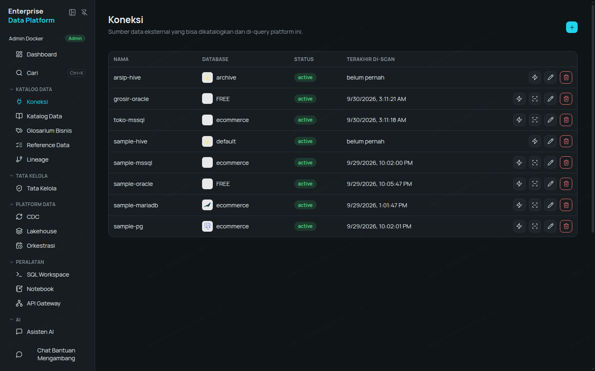
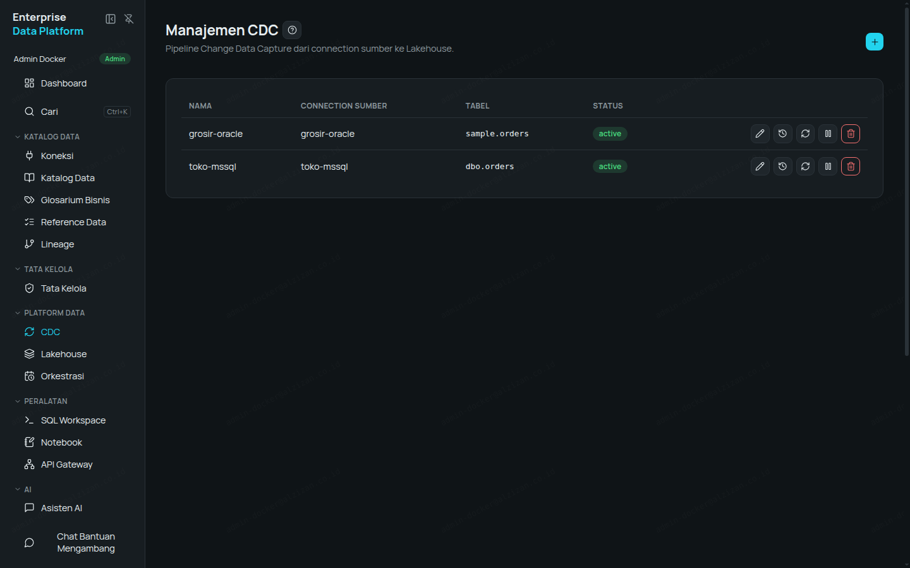
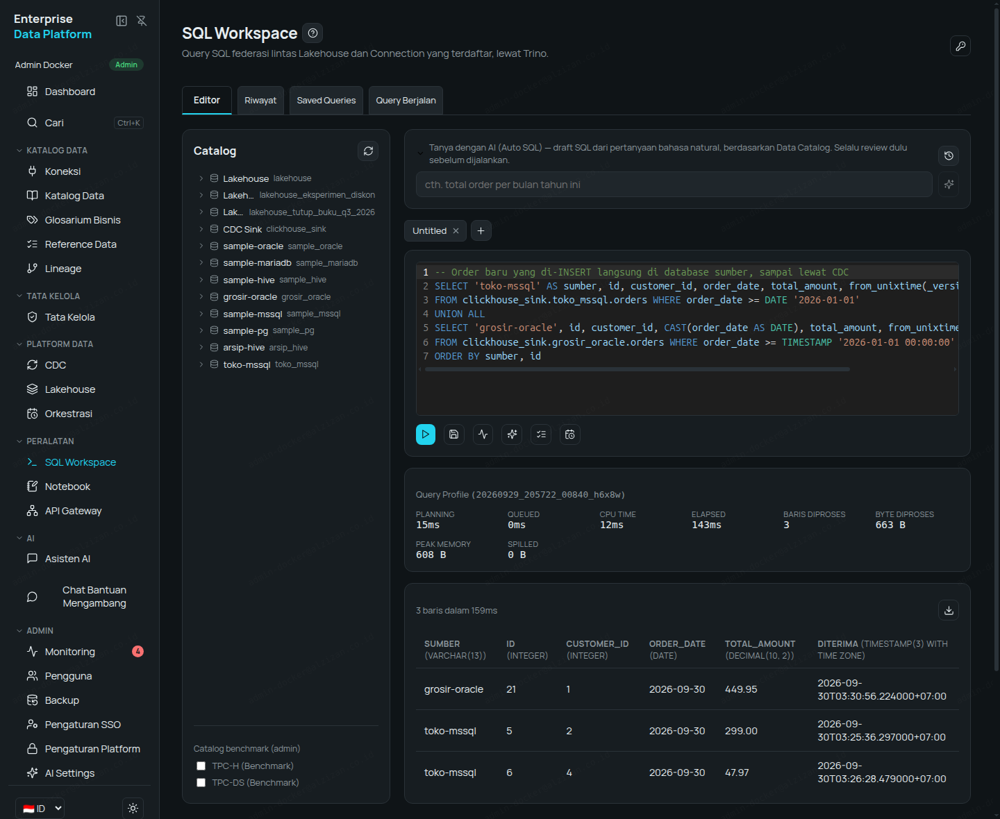
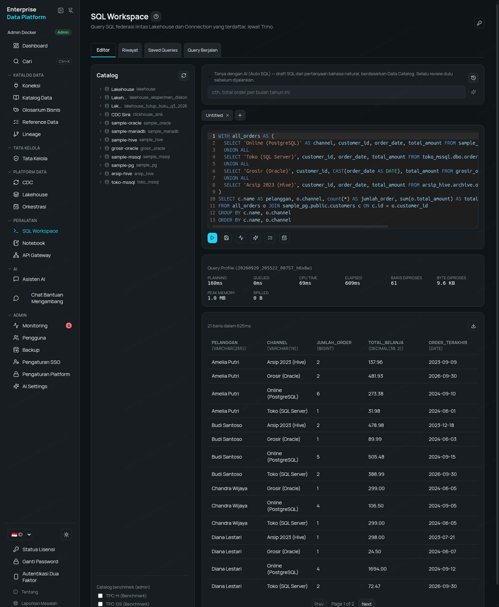
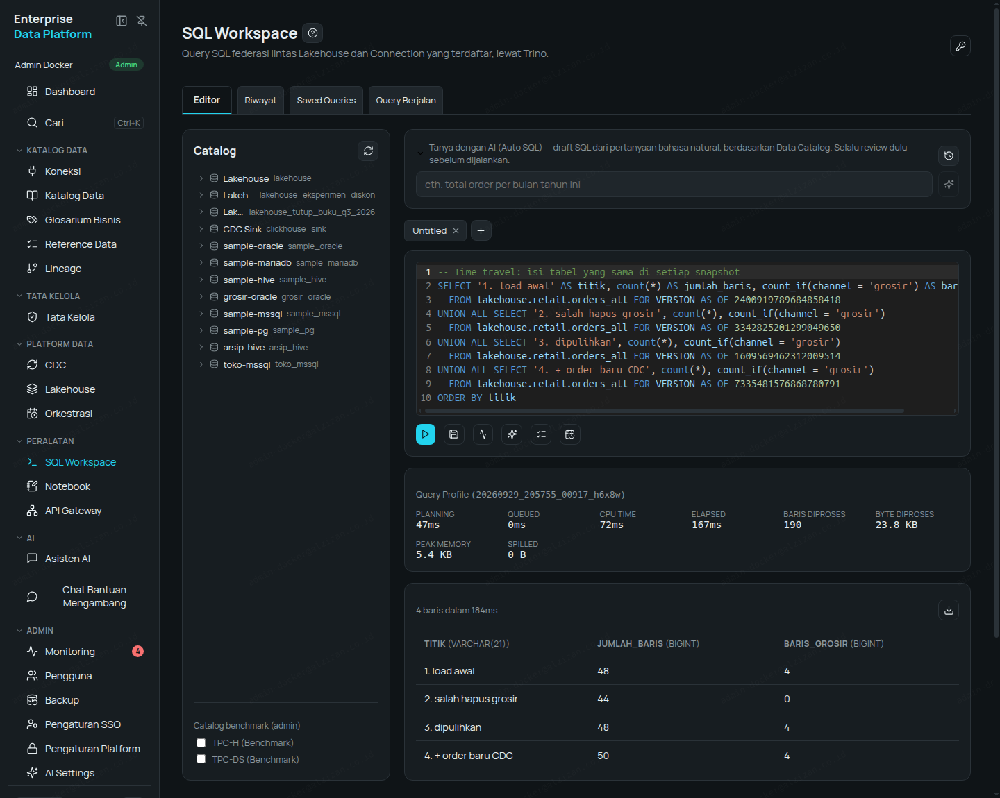
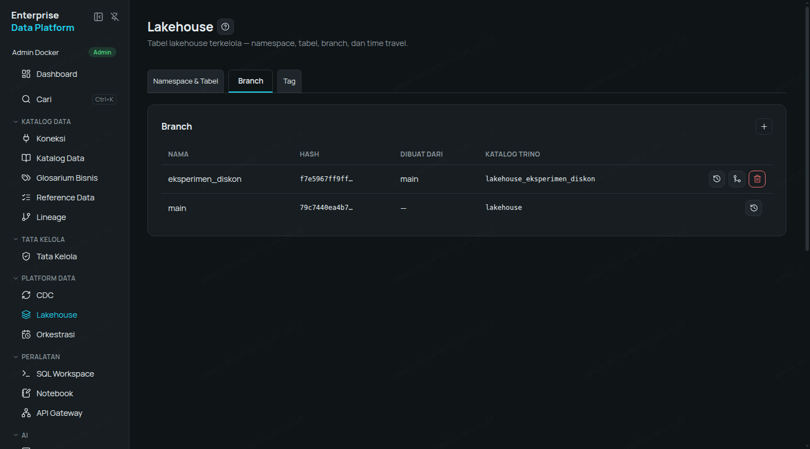
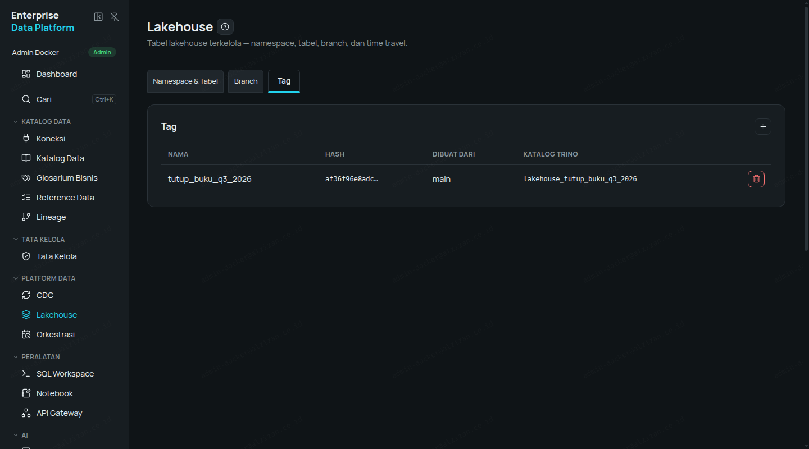
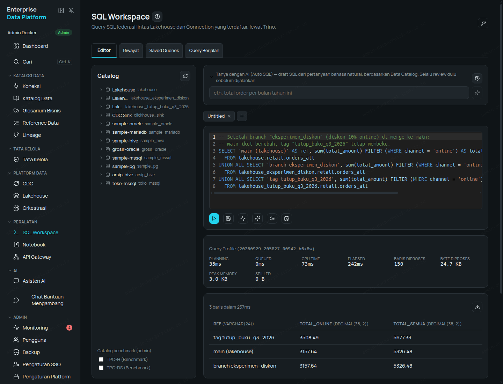

# Walkthrough — Empat Sumber Data, CDC, Query Federated, dan Lakehouse (Time Travel, Branch, Tag)

Oracle, PostgreSQL, SQL Server, dan data lake Hive disambungkan ke Enterprise Data Platform:
perubahan data mengalir otomatis lewat CDC, keempatnya di-query dengan satu SQL, lalu disimpan di
Lakehouse yang bisa "diputar ulang" (time travel), dibekukan (tag), dan dicoba tanpa risiko
(branch). Semua angka, SQL, dan screenshot di bawah adalah hasil nyata, bukan contoh karangan.

## Skenario

Sebuah grup ritel fiktif punya empat sistem yang tidak pernah bicara satu sama lain:

| Sistem | Teknologi | Isi | Nama Connection |
|---|---|---|---|
| Toko online | PostgreSQL | Pelanggan + order online | `sample-pg` |
| Kasir toko fisik | SQL Server | Order kasir | `toko-mssql` |
| ERP grosir | Oracle | Order grosir | `grosir-oracle` |
| Data lake lama (Hadoop) | Hive Metastore + S3 | Arsip order 2023 | `arsip-hive` |

Tujuan: satu tampilan order semua channel, perubahan terbaru mengalir otomatis (CDC), dan
riwayat yang bisa diaudit (Lakehouse dengan time travel, branch, tag) — tanpa memindahkan
database sumber.

## Bagian 1 — Sample Data & Connection

Pasang sample database (sekali):

```bash
curl -fsSL https://get.alzizan.co.id/sample-data | bash -s -- --services postgres,mssql,oracle,s3,hive
```

Buka **Connections → New Connection**, isi sesuai tipe database. Setelah tersimpan, klik **Scan**
supaya tabel & kolom masuk ke Data Catalog.

| Connection | Isian penting | Hasil scan |
|---|---|---|
| `sample-pg` (PostgreSQL) | host, port, database `ecommerce`, user/password | 11 tabel |
| `toko-mssql` (SQL Server) | host, port, database `ecommerce`, user/password | 4 tabel |
| `grosir-oracle` (Oracle) | host, port, **Database** = CDB (`FREE`), **PDB Name** = `FREEPDB1`, user/password skema aplikasi, **CDC Username/Password** = user LogMiner `c##dbzuser` | 3 tabel |
| `arsip-hive` (Apache Hive) | Metastore host + port `9083`, database `archive`, Storage Type **S3-compatible** + endpoint, access key, secret key, path-style access | — (Hive tidak perlu scan) |



**Catatan Oracle:** CDC Oracle butuh akun terpisah yang lebih berhak (common user `C##...` dengan
hak LogMiner) — praktik standar produksi, bukan memakai akun aplikasi. Prasyarat di sisi database:
`ARCHIVELOG`, supplemental logging, dan grant LogMiner.

**Catatan SQL Server:** CDC harus diaktifkan di database sumber (`sys.sp_cdc_enable_db` +
`sys.sp_cdc_enable_table`) dan SQL Server Agent harus berjalan.

### Data arsip di Hive

Tabel arsip dibuat langsung dari **SQL Workspace** — Hive bisa ditulis, bukan hanya dibaca:

```sql
CREATE SCHEMA arsip_hive.archive WITH (location = 's3a://hive-warehouse/archive');

CREATE TABLE arsip_hive.archive.orders_2023 (
  id INTEGER, customer_id INTEGER, product_id INTEGER, order_date DATE,
  status VARCHAR, quantity INTEGER, total_amount DECIMAL(10,2)
) WITH (format = 'PARQUET');

INSERT INTO arsip_hive.archive.orders_2023 VALUES
  (9001,1,1,DATE '2023-03-14','completed',3,47.97),
  (9002,2,3,DATE '2023-05-02','completed',1,299.00),
  (9003,4,4,DATE '2023-07-21','completed',2,298.00),
  (9004,1,2,DATE '2023-09-09','completed',1,89.99),
  (9005,3,1,DATE '2023-11-30','returned',1,15.99),
  (9006,2,2,DATE '2023-12-18','completed',2,179.98);
```

Hasil: 6 baris tersimpan sebagai file Parquet di S3, terbaca balik lewat `SELECT`.

## Bagian 2 — CDC, Satu Tabel per Database

Buka **CDC → New Pipeline**, pilih connection, isi tabel yang dipantau. Masing-masing cukup satu
tabel: `orders`.

| Pipeline | Tabel | Status connector | Snapshot awal |
|---|---|---|---|
| `sample-pg` | `public.orders` | RUNNING | 34 baris |
| `toko-mssql` | `dbo.orders` | RUNNING | 4 baris |
| `grosir-oracle` | `sample.orders` | RUNNING | 4 baris |



Data CDC langsung bisa di-query di katalog `clickhouse_sink.<nama_connection>.<tabel>` —
selalu versi terkini (sudah dideduplikasi):

```sql
SELECT id, order_date, total_amount FROM clickhouse_sink.toko_mssql.orders ORDER BY id;
```

### Bukti perubahan real-time

Insert baris baru langsung di database sumber (bukan lewat platform):

```sql
-- SQL Server (kasir)
INSERT INTO dbo.orders (customer_id, product_id, order_date, status, quantity, total_amount)
VALUES (4, 1, '2026-09-30', 'pending', 3, 47.97);

-- Oracle (grosir)
INSERT INTO orders (customer_id, product_id, order_date, status, quantity, total_amount)
VALUES (1, 2, DATE '2026-09-30', 'completed', 5, 449.95);
COMMIT;
```

| Sumber | Waktu sampai di `clickhouse_sink` |
|---|---|
| SQL Server | **9 detik** |
| Oracle (LogMiner) | ±11,5 menit (insert 03:19, tiba 03:30 WIB — 130 detik setelah redo log berganti) |



**Jujur soal Oracle:** CDC Oracle memakai LogMiner (gratis, bawaan Oracle). Perubahan terbaca
setelah redo log berganti; di instance kecil dengan redo log default 2×10 MB dan lalu lintas
rendah, jedanya bisa beberapa menit. Di produksi, redo log yang diukur sesuai rekomendasi (≥500 MB)
dan lalu lintas normal membuat jeda jauh lebih pendek. Untuk latensi sub-detik di Oracle, solusi
berbayar seperti XStream/GoldenGate tetap jadi pilihan.

**Kenapa Hive tidak di-CDC:** Hive Metastore hanya mencatat letak file, bukan database
transaksional — tidak ada log perubahan per baris yang bisa dibaca. Pola yang tepat untuk Hive:
query langsung (Bagian 3) atau salin berkala ke Lakehouse lewat Scheduled Job (Orchestration).

## Bagian 3 — Satu Query untuk Empat Sumber (Federated)

Di **SQL Workspace**, keempat sistem muncul sebagai katalog biasa. Satu query menggabungkan
semuanya — join ke tabel pelanggan di PostgreSQL:

```sql
WITH all_orders AS (
  SELECT 'Online (PostgreSQL)' AS channel, customer_id, order_date, total_amount
    FROM sample_pg.public.orders WHERE status <> 'cancelled'
  UNION ALL
  SELECT 'Toko (SQL Server)', customer_id, order_date, total_amount
    FROM toko_mssql.dbo.orders WHERE status <> 'cancelled'
  UNION ALL
  SELECT 'Grosir (Oracle)', customer_id, CAST(order_date AS DATE), total_amount
    FROM grosir_oracle.sample.orders WHERE status <> 'cancelled'
  UNION ALL
  SELECT 'Arsip 2023 (Hive)', customer_id, order_date, total_amount
    FROM arsip_hive.archive.orders_2023 WHERE status = 'completed'
)
SELECT c.name AS pelanggan, o.channel, count(*) AS jumlah_order,
       sum(o.total_amount) AS total_belanja, max(o.order_date) AS order_terakhir
FROM all_orders o JOIN sample_pg.public.customers c ON c.id = o.customer_id
GROUP BY c.name, o.channel
ORDER BY c.name, o.channel;
```

Hasil nyata (21 baris, **di bawah 2 detik**; angka sudah termasuk order baru dari CDC di Bagian 2), potongan:

| pelanggan | channel | jumlah_order | total_belanja | order_terakhir |
|---|---|---|---|---|
| Amelia Putri | Arsip 2023 (Hive) | 2 | 137.96 | 2023-09-09 |
| Amelia Putri | Grosir (Oracle) | 2 | 481.93 | 2026-09-30 |
| Amelia Putri | Online (PostgreSQL) | 6 | 273.38 | 2024-09-10 |
| Amelia Putri | Toko (SQL Server) | 1 | 31.98 | 2024-06-01 |
| Budi Santoso | Arsip 2023 (Hive) | 2 | 478.98 | 2023-12-18 |
| Budi Santoso | Toko (SQL Server) | 2 | 388.99 | 2026-09-30 |
| Diana Lestari | Online (PostgreSQL) | 4 | 1694.00 | 2024-09-12 |



Tidak ada data yang dipindah dulu. Hak akses & masking tetap berlaku per sumber — user hanya
melihat kolom/baris yang memang boleh ia lihat.

## Bagian 4 — Lakehouse: Time Travel, Branch, Tag

### 4.1 Satukan ke Lakehouse

Buat namespace **Lakehouse → New Namespace** `retail`, lalu satu `CREATE TABLE AS SELECT`
menyalin gabungan keempat sumber ke tabel Iceberg:

```sql
CREATE TABLE lakehouse.retail.orders_all AS
SELECT 'online' AS channel, id AS order_id, customer_id, order_date, status, total_amount FROM sample_pg.public.orders
UNION ALL SELECT 'toko', id, customer_id, order_date, status, total_amount FROM toko_mssql.dbo.orders
UNION ALL SELECT 'grosir', id, customer_id, CAST(order_date AS DATE), status, total_amount FROM grosir_oracle.sample.orders
UNION ALL SELECT 'arsip_2023', id, customer_id, order_date, status, total_amount FROM arsip_hive.archive.orders_2023;
```

Hasil: **48 baris** (online 34, toko 4, grosir 4, arsip_2023 6).

### 4.2 Time Travel — pulihkan data yang terhapus

Seseorang tidak sengaja menghapus semua order grosir:

```sql
DELETE FROM lakehouse.retail.orders_all WHERE channel = 'grosir';
```

Setiap perubahan tercatat sebagai snapshot:

```sql
SELECT snapshot_id, committed_at, operation
FROM lakehouse.retail."orders_all$snapshots" ORDER BY committed_at;
```

Lihat kondisi **sebelum** penghapusan, lalu pulihkan hanya baris yang hilang:

```sql
SELECT channel, count(*) FROM lakehouse.retail.orders_all
FOR VERSION AS OF 2400919789684858418 GROUP BY channel;   -- grosir masih 4

INSERT INTO lakehouse.retail.orders_all
SELECT * FROM lakehouse.retail.orders_all FOR VERSION AS OF 2400919789684858418
WHERE channel = 'grosir';
```

Lalu tambahkan order baru dari CDC kasir (Bagian 2):

```sql
INSERT INTO lakehouse.retail.orders_all
SELECT 'toko', CAST(id AS decimal(10,0)), CAST(customer_id AS decimal(10,0)),
       order_date, from_utf8(status), total_amount
FROM clickhouse_sink.toko_mssql.orders WHERE id > 4;
```

Riwayat nyata:

| Snapshot | Waktu (WIB) | Operasi | Jumlah baris saat itu |
|---|---|---|---|
| `2400919789684858418` | 03:19:04 | append (load awal) | 48 |
| `3342825201299049650` | 03:27:26 | delete (salah hapus) | 44 |
| `1609569462312009514` | 03:27:42 | append (pemulihan) | 48 |
| `7335481576868780791` | 03:27:43 | append (order baru CDC) | 50 |

Query berdasarkan waktu juga bisa:
`... FOR TIMESTAMP AS OF TIMESTAMP '2026-09-30 03:20:00 Asia/Jakarta'` → 48 baris.



**Tips:** saat menyalin dari `clickhouse_sink` ke Lakehouse, kolom teks perlu `from_utf8(...)`
dan tipe angka disamakan dengan tabel tujuan.

### 4.3 Tag — bekukan kondisi tutup buku

**Lakehouse → Tags → New Tag**: `tutup_buku_q3_2026` dari `main`. Tag langsung bisa di-query
sebagai katalog `lakehouse_tutup_buku_q3_2026`, dan **tidak bisa diubah**:

```sql
INSERT INTO lakehouse_tutup_buku_q3_2026.retail.orders_all
SELECT * FROM lakehouse.retail.orders_all LIMIT 1;
-- Ditolak: "You can only mutate tables/views when using a branch without a hash or timestamp."
```

### 4.4 Branch — eksperimen tanpa mengganggu data utama

**Lakehouse → Branches → New Branch**: `eksperimen_diskon` dari `main`. Simulasikan diskon 10%
untuk channel online, hanya di branch:

```sql
UPDATE lakehouse_eksperimen_diskon.retail.orders_all
SET total_amount = total_amount * 0.9 WHERE channel = 'online';   -- 34 baris
```

Bandingkan ketiga ref:

| Katalog | Total online | Total semua channel |
|---|---|---|
| `lakehouse` (main) | 3508.49 | 5677.33 |
| `lakehouse_eksperimen_diskon` (branch) | **3157.64** | 5326.48 |
| `lakehouse_tutup_buku_q3_2026` (tag) | 3508.49 | 5677.33 |

Eksperimen disetujui → **Merge** branch ke `main` (tombol Merge di tab Branches). Hasil nyata:
`was_applied: true`, tanpa konflik. Sesudah merge:

| Katalog | Total online |
|---|---|
| `lakehouse` (main) | 3157.64 — ikut berubah |
| `lakehouse_tutup_buku_q3_2026` (tag) | 3508.49 — **tetap**, kondisi tutup buku terjaga |







## Bagian 5 — Nessie vs Hive Metastore

Keduanya adalah **katalog metadata**: tempat mencatat "tabel X ada, skemanya begini, file datanya
di sini". Data sesungguhnya tetap berupa file (Parquet/ORC) di object storage/HDFS. Bedanya ada di
*apa yang dicatat* dan *bagaimana perubahan dilacak*.

| Aspek | Hive Metastore | Nessie (katalog Lakehouse platform) |
|---|---|---|
| Asal | Ekosistem Hadoop, standar de-facto sejak 2010-an | Proyek modern untuk Apache Iceberg |
| Format tabel | Tabel Hive (direktori berisi file) | Apache Iceberg (snapshot + manifest) |
| Yang dicatat | Lokasi tabel/partisi *saat ini* | Pointer metadata Iceberg per commit, seperti Git |
| Riwayat perubahan | Tidak ada — hanya kondisi terkini | Setiap perubahan = commit ber-hash, bisa ditelusuri |
| Time travel | Tidak ada | Ya — `FOR VERSION AS OF` / `FOR TIMESTAMP AS OF` |
| Branch & Tag | Tidak ada | Ya — branch untuk eksperimen, tag untuk membekukan |
| Transaksi multi-tabel | Tidak ada | Ya — satu commit bisa mencakup banyak tabel |
| Perubahan skema | Terbatas (tambah kolom; rename/hapus berisiko) | Penuh (tambah, rename, hapus, ubah urutan) |
| UPDATE/DELETE baris | Terbatas (butuh tabel ACID khusus) | Didukung (`UPDATE`, `DELETE`, `MERGE`) |
| Protokol | Thrift | REST API |
| Cocok untuk | Data lake Hadoop yang sudah ada & dipakai banyak tool lama | Lakehouse baru yang butuh audit, versi, dan eksperimen aman |

**Kapan pakai yang mana:**

- **Hive Metastore** → sambungkan sebagai Connection bila perusahaan sudah punya data lake
  Hadoop/Hive. Datanya langsung bisa di-query dan di-join dengan sumber lain (Bagian 3) tanpa
  migrasi.
- **Nessie** → dipakai Lakehouse bawaan platform. Data baru (hasil CDC, hasil transformasi, arsip)
  sebaiknya mendarat di sini supaya dapat time travel, branch, dan tag (Bagian 4).
- **Pola migrasi umum:** biarkan Hive tetap berjalan untuk tool lama, lalu salin tabel yang aktif
  dipakai ke Lakehouse dengan satu `CREATE TABLE ... AS SELECT` — persis seperti Bagian 4.1.

## Ringkasan

- 4 database berbeda terhubung dan ter-scan dalam hitungan menit, tanpa memindahkan data.
- CDC Oracle, PostgreSQL, dan SQL Server jalan dengan satu form; perubahan SQL Server tiba dalam
  9 detik.
- Satu query SQL menggabungkan keempat sumber dalam waktu di bawah 2 detik.
- Lakehouse menyimpan riwayat penuh: pulihkan salah hapus dengan time travel, bekukan tutup buku
  dengan tag, uji perubahan dengan branch lalu merge.

## Coba Sendiri

- Trial gratis 14 hari, tanpa sales call: https://alzizan.co.id/register
- Demo video: https://www.youtube.com/@AlzizanDigitalSolutions

---

Konten repo ini dilisensikan [CC BY 4.0](LICENSE). © PT Alzizan Digital Solutions.
